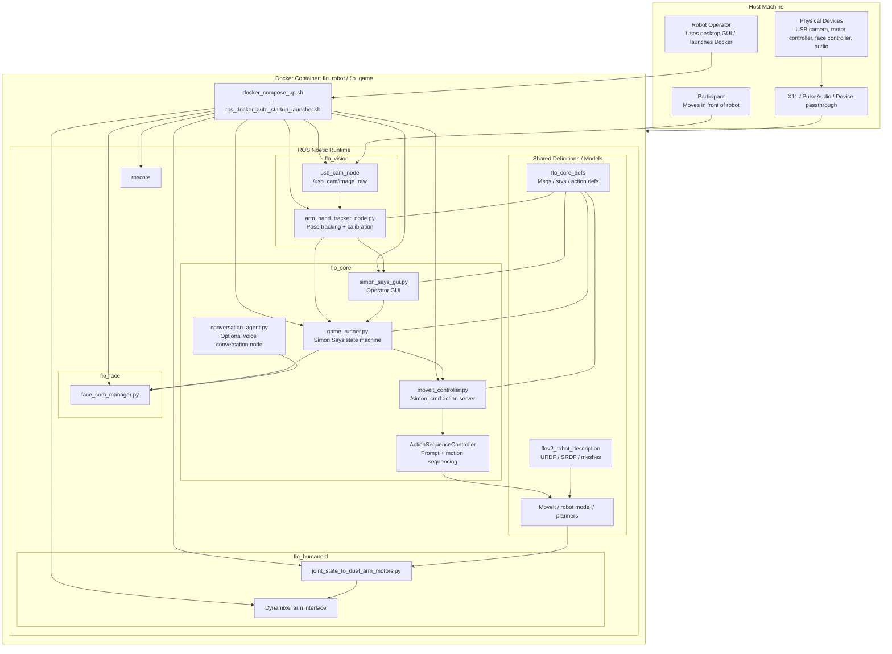
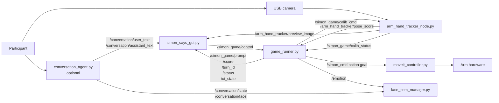
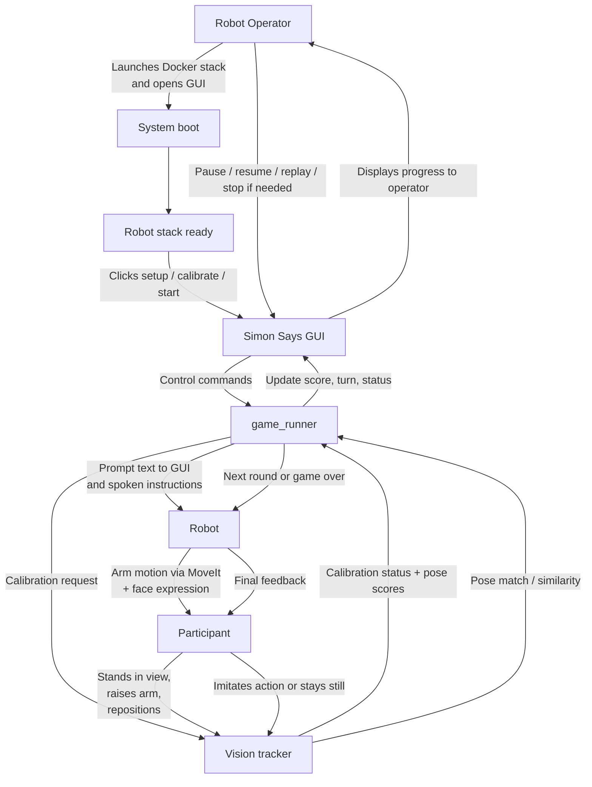

# FLO V2 Stack Diagrams

These diagrams describe the current stack in this repository and the main
interaction loop for the Simon Says demo.

## Stack Architecture

## ROS Interaction View

## Human-Robot Interaction Flow

## Role Summary

- `Robot operator`: starts the stack, monitors the GUI, and controls game flow.
- `Participant`: responds to Flo's instructions and is tracked by the vision node.
- `Robot`: combines arm motion, face output, and spoken prompts to run the activity.
- `Vision system`: closes the loop by checking whether the participant matched the expected pose.

